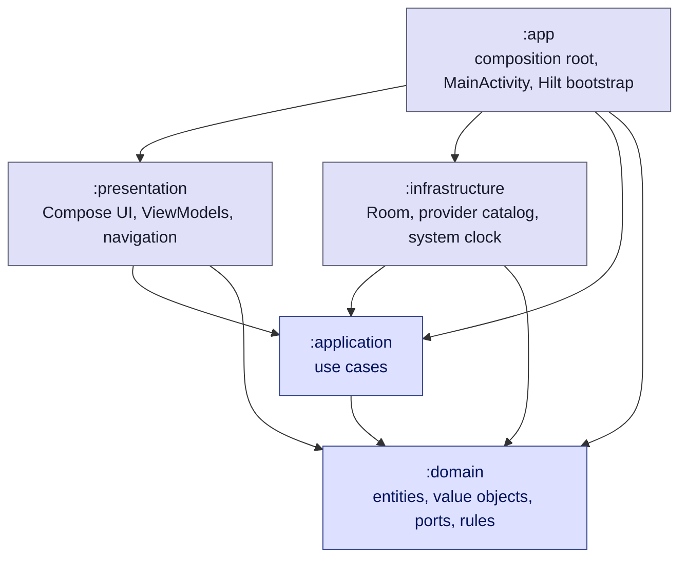

# Griff Subscriptions

Android app for keeping every private subscription (Netflix, Spotify, ChatGPT, Google Workspace,
hosting, domains, …) in one place: what you pay, how often, when the next renewal is due, and what
it all costs per month and per year.

The first version is fully offline — everything is stored locally in Room. There is no backend, no
account, no cloud sync and no Google Play billing integration, but the architecture is prepared for
adding those later without a rewrite.

## Features

- List of subscriptions with logo/monogram, billing period and price, plus a live search
- Normalized totals: monthly and yearly cost that never mixes monthly and yearly prices
- Add / edit / delete with a Material 3 confirmation dialog and undo-safe messaging
- Searchable catalog of 50+ popular Polish and global services with default management URLs,
  and an "Other" entry for anything custom
- Details screen with a deep link to the provider's management page in an external browser
- Statistics: summary cards, period filter (month / year / rolling 12 months), forecast of real
  charges based on renewal dates, category breakdown and the most expensive subscriptions
- Navigation drawer with the real `versionName` / `versionCode` of the running build
- Light and dark theme, dynamic color on Android 12+, edge-to-edge, Polish UI

## Architecture

Clean Architecture with real Gradle modules; the dependency rule points inwards, so the domain has
no knowledge of Android, Room or Compose.



Dependency inversion in one sentence: `:infrastructure` depends on `:domain` and implements its
ports (`SubscriptionRepository`, `ProviderCatalog`, `ClockProvider`, `SubscriptionIdGenerator`);
nothing in `:domain` or `:application` knows that Room exists. `:app` is the only module that wires
implementations to ports (Hilt) and the only module that reads `BuildConfig`.

| Module            | Type                | Contains                                                                                              | May depend on          |
|-------------------|---------------------|-------------------------------------------------------------------------------------------------------|------------------------|
| `:domain`         | Kotlin JVM          | `Subscription`, `Money`, `BillingPeriod`, `Provider`, validation, cost normalization, statistics rules | coroutines only        |
| `:application`    | Kotlin JVM          | use cases (`AddSubscriptionUseCase`, `SearchSubscriptionsUseCase`, …), `AppVersionProvider` port       | `:domain`              |
| `:infrastructure` | Android library     | Room database/DAO/entity/mappers, `RoomSubscriptionRepository`, static provider catalog, Hilt modules  | `:domain`,`:application` |
| `:presentation`   | Android library      | Compose screens, ViewModels, UI state, navigation graph, Material 3 theme, formatters                 | `:domain`,`:application` |
| `:app`            | Android application | `Application`, `MainActivity`, composition root, `BuildConfig` bridge                                  | all of the above       |

Data flows one way:

```
UI event -> ViewModel -> UseCase -> Repository -> Room
Room Flow -> Repository -> UseCase -> ViewModel StateFlow -> Compose
```

Screens are split into `Route` (Hilt + state collection), `Screen` (Scaffold, snackbars, dialogs)
and `Content` (stateless layout), which keeps the Compose UI testable without Hilt.

## Tech stack

Kotlin 2.2.10, Jetpack Compose (BOM 2026.06.01) with Material 3, Coroutines/Flow, Room 2.8.4,
Hilt 2.60.1, Navigation Compose 2.9.8 (type-safe routes with kotlinx.serialization), KSP 2.3.11,
Gradle 9.2.1 with Kotlin DSL and a version catalog, AGP 9.0.1 (built-in Kotlin support — the Kotlin
Android plugin is not applied separately). No XML layouts.

**Why these versions:** they are the newest mutually compatible releases that still work with
AGP 9.0.1 / `compileSdk 36`, which is what the project's Android Studio (2025.3) supports. Newer
AndroidX artifacts (core-ktx 1.19, lifecycle 2.11, Compose BOM 2026.08, hilt-navigation-compose 1.4)
require AGP 9.1 and `compileSdk 37`; upgrade them together with Android Studio and AGP. Lint keeps
reporting those as available upgrades on purpose. `minSdk` is 26 so `java.time` can be used without
desugaring.

## Running the project

```bash
./gradlew :app:installDebug     # build and install on a connected device/emulator
./gradlew assembleDebug         # debug APK
./gradlew test                  # unit tests of all modules
./gradlew connectedAndroidTest  # Room and Compose UI tests (needs a device/emulator)
./gradlew lint                  # Android lint, fails the build on errors
./gradlew :app:assembleRelease  # R8 + resource shrinking (signing config not committed)
```

The release build type is minified and resource-shrunk; it was verified end to end on a device with
a debug-signed release APK, so the R8 rules for Room, Hilt and navigation serialization are known to
work. A real signing config has to be added before publishing.

## Data storage

- Room database `subscriptions.db`, `version = 1`, `exportSchema = true`; the schema is written to
  `infrastructure/schemas/` and should be committed with every version bump.
- `fallbackToDestructiveMigration()` is deliberately **not** used. New versions add a `Migration` to
  `DatabaseMigrations` in `infrastructure/database/DatabaseMigrations.kt`.
- The entity stores primitives only: amounts as `Long` minor units, dates as epoch day / epoch
  millis, enums as their names, plus a `currency_code` column so multi-currency support does not
  need a breaking change. `SubscriptionMapper` translates to and from the domain model, so the
  schema can evolve independently.
- All DAO functions are `suspend` or return `Flow`; `allowMainThreadQueries()` is never used and the
  repository maps entities on the IO dispatcher.

## Key decisions

- **Money is never a floating point number.** `Money` is a value class over `Long` minor units
  (grosze) with `plus`, `times` and `dividedBy` (rounded half up) and a non-negative invariant. It is
  formatted for display only (`34,99 zł`, `1 299,00 zł` with the Polish grouping separator).
- **Normalization lives in the domain.** `Subscription.monthlyEquivalent` divides a yearly price by
  12 (half up), `yearlyEquivalent` multiplies a monthly price by 12. The monthly total is the sum of
  the rounded monthly equivalents; the yearly total is the sum of the exact yearly amounts rather
  than `monthlyTotal * 12`, so yearly subscriptions are not distorted by monthly rounding.
- **Validated input is a type.** `SubscriptionInputValidator` turns raw form strings into
  `ValidatedSubscriptionInput` (internal constructor) — use cases accept nothing else, so
  unvalidated data cannot reach the repository. The UI input filter is only a convenience on top of
  `PriceParser`.
- **Forecast never pretends to know a date it was not given.** Statistics separate the always
  available normalized cost from the forecast of real charges, which only includes subscriptions
  with a `nextBillingDate`; the rest is reported as "N subscriptions without a renewal date".
  Charge dates are computed as `anchor + n * period`, so a subscription billed on the 29th stays on
  the 29th after February.
- **Time is injectable.** `ClockProvider` is a domain port (`SystemClockProvider` in
  infrastructure), so every date-dependent rule is unit tested with a fixed clock.
- **Provider catalog is static data, not UI code.** `ProviderCatalogSource` in `:infrastructure`
  behind the `ProviderCatalog` port, ready to be swapped for a remote or database backed source.
  "Other" is always the last entry and is the only catalog name translated by the UI.
- **Logos: no bundled trademarks.** Brand logos cannot be shipped without a license, so
  `ProviderLogo` renders a neutral monogram on a tonal circle whose color is derived from the
  `logoKey` (custom entries are seeded by their name, so they do not all look alike). Licensed
  assets can be added in `ProviderLogoAssets` without touching any other layer; the domain only ever
  knows the abstract `logoKey`.
- **No charting library.** One bar chart and one set of category bars are drawn with Compose
  `Canvas` and plain layouts; they follow the Material color scheme, carry accessibility
  descriptions and add no dependency. Horizontal bars were chosen over a donut because they stay
  readable with ten categories and expose exact amounts.
- **Type-safe navigation.** Routes are `@Serializable` objects/classes; only ids travel between
  destinations and each screen loads its own data through use cases. Add and edit share one screen
  and one ViewModel, distinguished by the presence of the `subscriptionId` argument.
- **Application id.** Changed from the template's `com.example.griffsubscriptions` to
  `com.griff.subscriptions` (`com.example` cannot be published to Google Play). Debug builds use the
  `.debug` suffix so both variants can be installed side by side.

## Tests

- `:domain` — `Money`, `PriceParser`, validation, cost normalization, search matching, billing
  schedule and the statistics calculator (fixed dates, no Android dependencies).
- `:application` — use cases against in-memory fakes; shared test doubles live in the
  `testFixtures` source set of `:domain` so every layer reuses them.
- `:infrastructure` — mapper and catalog unit tests plus instrumented tests of
  `RoomSubscriptionRepository` on a real in-memory database.
- `:presentation` — formatter and `HomeViewModel` unit tests, and Compose UI tests for the home
  screen (empty state, list, totals, search, row clicks) and the subscription form (save button
  gating, validation messages, provider selection).
- `:app` — instrumented smoke test that starts `MainActivity` with the real Hilt graph, so a broken
  binding or navigation setup fails in CI instead of on a device.

## Deliberately out of scope (and where it would go)

| Future feature                   | Where it plugs in                                                             |
|----------------------------------|-------------------------------------------------------------------------------|
| Backend / cloud sync             | A second `SubscriptionRepository` implementation, or a sync source behind it   |
| Renewal reminders (notifications)| A new use case over `BillingSchedule` plus a WorkManager scheduler in `:app`   |
| Multiple currencies              | `Currency` in the domain and the existing `currency_code` column              |
| English UI                       | `presentation/src/main/res/values-en/strings.xml` — no strings are hardcoded   |
| Google Play subscriptions import | An infrastructure adapter mapping Play data to `ValidatedSubscriptionInput`    |
