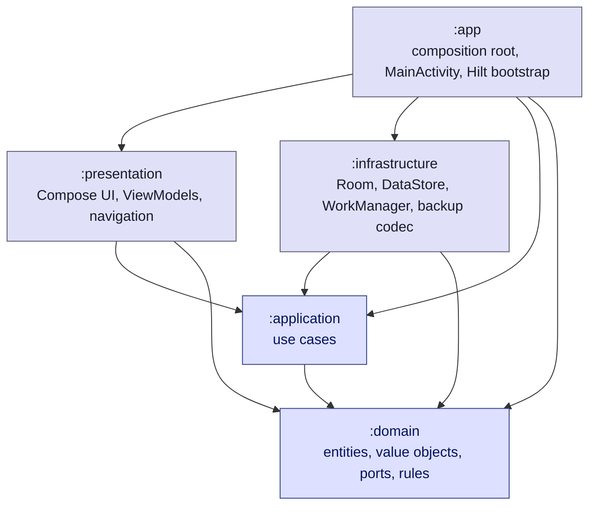

# Griff Keeper

A local-first Android app for subscriptions, insurance, payments and reminders.

Griff Keeper is a privacy-first Android application for keeping subscriptions, insurance policies,
recurring payments, taxes, deadlines and reminders in one place. Everything lives on the device:
there is **no account, no backend, no Firebase and no cloud synchronization**. The only way data
leaves the phone is an encrypted backup file the user creates and moves themselves.

It exists to answer a short list of questions without a spreadsheet:

- What am I paying for?
- How much do my recurring services cost per month and per year?
- When does my insurance expire?
- What payments are due soon?
- What did I actually pay this year?
- What renews next?
- When will Griff Keeper tell me about it?

## What Griff Keeper does

Griff Keeper keeps recurring financial commitments and their deadlines in one place — a Spotify
renewal, a vehicle insurance policy expiring in September, property tax with a payment deadline, a
hosting renewal, a Google Workspace subscription, drone insurance — and tells the user before each
of them matters.

```text
Griff Keeper
├── Subscriptions
├── Insurance & obligations
├── Statistics
├── Reminders
├── Import / Export
└── Language (Polski / English)
```

The interface is available in **Polish and English**, switchable from the navigation drawer. The
codebase, the documentation and every identifier are English regardless of the interface language.

## Features

### Subscriptions

The start destination (`SubscriptionRoute`) is the subscription list, named after what it shows
rather than after its position in the graph.

- List of subscriptions with the provider's brand glyph or a monogram, the category tag, the billing
  period and the price.
- Monthly or yearly billing period, with a **normalized** monthly and yearly equivalent so the app
  never adds a monthly price to a yearly one. The monthly total is the sum of the rounded monthly
  equivalents; the yearly total is the sum of exact yearly amounts rather than `monthly × 12`, so
  yearly subscriptions are not distorted by monthly rounding.
- Totals bar pinned to the bottom of the list — monthly and yearly cost — which says explicitly
  when it is summing only the visible items rather than everything.
- Next billing date, and a details screen with the price, both equivalents, the renewal date, the
  category and the provider's management URL, which opens in an external browser.
- Add, edit and delete; deletion asks for confirmation first.
- Offline catalog of 52 popular Polish and global services with default management URLs, plus an
  `Other` entry for anything custom — a custom entry supplies its own name and category.
- Live search and a category filter chip row.
- Per-record reminder switch on the form and on the details screen.

### Insurance & obligations

A second module for amounts that come back every period and have a deadline. The shared trait is
not "an insurance" — it deliberately mixes policies with periodic public charges.

Categories: vehicle insurance, home insurance, land insurance, drone insurance, property tax, land
tax and `Other`.

Each record stores:

| Field | Meaning |
| --- | --- |
| `name` | What the record is |
| `category` | Drives the tag, the icon and which dates the form puts forward |
| `amount` | The charge, as exact minor units |
| `payment` | Paid (with the date it was settled) or unpaid |
| `dueDate` | Deadline of an unpaid charge |
| `validUntil` | When cover ends |
| `notes` | Free text |
| `remindersEnabled` | The record's own reminder switch |

The three dates are not interchangeable, and the model keeps them apart on purpose:

- the **payment date** is the only date an expense is booked to — a policy paid in December 2026 and
  valid until December 2027 is a 2026 expense;
- **valid-until** drives expiry reminders and never expense attribution;
- **due date** is the deadline of an open charge.

The list is ordered by whichever deadline the record is actually about, soonest (including overdue)
first, and marks an approaching or missed deadline in words rather than by color alone. Other
features: a month/year period selector with previous/next stepping, paid and outstanding totals for
the selected window, live search, tag filtering, a details screen, and add / edit / delete with a
confirmation dialog.

### Reminders

Local reminders for subscriptions, insurance and other obligations. Nothing is sent anywhere: a
daily `WorkManager` job asks the domain what today implies and posts Android notifications through
`NotificationCompat`. **There is no Firebase Cloud Messaging and no network access of any kind.**

Default schedules:

```text
Insurance            30, 7 and 1 day before expiry
Other obligations     7 and 1 day before the due date
Subscriptions         7 and 1 day before renewal
```

Which date a reminder is about:

```text
Subscription reminder → nextBillingDate
Insurance reminder    → validUntil
Unpaid obligation     → dueDate
```

A settled charge stops producing payment reminders, but a **paid insurance policy still produces
expiry reminders** — the cover running out is the thing worth knowing about.

The Reminders screen shows:

- a global reminders on/off switch, kept separate from the per-record switches so turning it back on
  restores exactly what the user had chosen;
- upcoming reminders, most urgent first, each with its target date, days until the target, the next
  reminder date and the days until it speaks;
- everything the engine currently has nothing to say about, with the reason — switched off, no date
  to count down to, or every reminder for that date already in the past;
- a filter for all records / subscriptions / insurance / other charges;
- a warning when the app-wide switch is on but Android is blocking notifications, plus the runtime
  permission request on Android 13+.

Tapping a notification deep-links straight to the right details screen (`griff://subscription/{id}`
and `griff://obligation/{id}`, restricted to the app's own package).

### Statistics

One screen, three scopes — **All**, **Subscriptions**, **Obligations** — over a month, the current
year, or a rolling twelve months.

**Subscriptions** — normalized monthly cost, estimated yearly cost, a forecast of real charges built
from renewal dates (with an explicit count of subscriptions that have no renewal date, so the app
never pretends to know a charge date it was not given), upcoming charges, a category breakdown and
the most expensive subscriptions.

**Obligations** — what was actually paid inside the selected window, month by month, a tag
breakdown, the largest payments, and outstanding amounts reported separately from settled ones.

**All** — a combined overview where each figure keeps its meaning in its own label: estimated
subscription cost, obligation payments actually made, their sum, a chart with the two series kept
apart, and a combined "largest costs" list where every row says which module it came from.

The distinction is preserved everywhere:

```text
Subscriptions → normalized / estimated recurring cost
Obligations   → actual payments
```

### Import & export

Because there is no backend and no account, moving data between devices is a first-class feature
rather than an afterthought.

- **Export** an encrypted backup to any location the system document picker offers.
- **Share** a backup through any compatible app (a mail client, for example). Griff Keeper never
  sends anything itself — it stages one file and hands a temporary, read-only handle to the app the
  user picks in the chooser. If the device is offline it says so first, since the message may sit in
  an outbox.
- **Import** from a backup: the file is checked before the password is asked for, and the password
  unlocks a **preview** — creation date, app version, record counts — shown before anything is
  written.
- **Merge** or **Replace**, with a second confirmation for Replace.
- A **backup password** chosen by the user, minimum 8 characters. There is no recovery: the app is
  offline and keeps no copy of it.
- **Operation history**: the last 20 imports and exports with their type, status, date and time,
  record counts and, on failure, the category of what went wrong. The log describes this
  installation, so it is never part of a backup — and it survives a Replace import, so the very
  import that wiped the records is still visible right afterwards.

Import modes:

| Mode | What it does |
| --- | --- |
| `MERGE` | Keeps local records and adds the ones the backup carries. A record both sides know is left alone when the content is identical, and refreshed when the backup's `updatedAt` is newer; ties keep the local row. A local record the backup does not mention is untouched. |
| `REPLACE` | Discards the local portable data and leaves exactly what the backup carried. Requires an extra confirmation. |

Identity is the record's own UUID, minted once on creation and never rewritten, so importing the
same file twice is a no-op instead of a source of duplicates. Records that merely look alike (same
name, different id) are **counted and reported in the preview, never merged** — only the id is
evidence.

### Search, tags & filtering

Both modules share the same interaction model, so it is described once:

- live text search that filters as the user types;
- a tag / category chip row that only offers filters that can actually match something in the
  collection;
- filters combine with search;
- month and year filtering on obligations and on statistics;
- empty states that distinguish "nothing stored yet" from "nothing matches these filters".

Tags are a shared system across both modules. Subscription categories are Video, Music, AI, Cloud,
Software, Hosting, Shopping, Gaming, Books and Other; obligation tags are Vehicle, Home, Land,
Drone, Tax and Other. Tags appear on list rows, on details screens and as filter chips, they drive
the category breakdowns in Statistics, and label plus color come from one place in the presentation
layer — so an obligation badge and a subscription badge look like members of the same system.

### Language support

- **Polish and English interface**, and nothing in between: every screen, dialog, snackbar,
  validation message, notification and accessibility label is translated.
- **In-app language switcher in the navigation drawer**, which also shows the language currently in
  use — so the drawer answers both "where do I change it" and "what am I in" without opening
  anything. Tapping it opens a two-option Material 3 dialog.
- The switch takes effect immediately. Android recreates the activity to apply a new locale, and the
  user stays on the screen they were reading rather than being sent back to the start.
- **The choice persists** across activity recreation, process death, an app restart and a reboot,
  and it is stored by the platform rather than by the app, so there is only one answer to "which
  language is this app in".
- A fresh install follows the system language, falling back to English when the system is set to a
  language Griff Keeper does not ship.
- **Dates, amounts, plurals and the currency symbol follow the active language** — `21 sierpnia 2026`
  and `1 299,00 zł` against `August 21, 2026` and `1,299.00 PLN` — from CLDR rather than from
  hand-written rules. Polish plural forms (`1 dzień`, `2 dni`, `5 dni`) come from Android `<plurals>`
  resources, not from an `if` in the UI.
- **Reminder notifications use the app's language, not the phone's**, including when they are built
  by the background worker with no screen open.
- Changing the language changes nothing else: not the light/dark theme, not the reminder settings,
  and not a single stored record.
- Backups are language independent — see *Backup & data portability*.

### Material 3 experience

- Jetpack Compose and Material 3 throughout. **The UI is implemented entirely with Jetpack
  Compose — no XML layouts.**
- The **"Graphite Precision"** design system, mapped onto the Material 3 roles. Light theme: warm
  off-white surfaces with a saturated Griff Blue accent. Dark theme: tiered graphite - not pure
  black - with a Griff Cyan accent. The accent *pivots* with the mode rather than being inverted, so
  it stays readable at both ends. Every Material 3 color role is spelled out so nothing falls back
  to the baseline Material purple.
- **Dynamic color is deliberately off**: the brand accent is the point of the palette. The parameter
  is still there so the choice can become a user setting later.
- **Inter as the single type family**, requested through the Play Services font provider rather than
  bundled, with the platform font as the fallback. The scale is tuned for data density: tighter
  tracking and heavier weights on headlines, default tracking on body text.
- One shape rule, split by kind rather than by size: content containers are framed at 16dp, and
  anything the user acts on - buttons, fields, chips - sits at 8dp. Filled cards carry a hairline
  edge that only paints on graphite, where a tonal step alone would not separate them.
- Edge-to-edge, a navigation drawer that shows the real `versionName` / `versionCode` of the running
  build, an in-drawer language switcher, and an About screen describing what the app does, where the
  data lives and how to reach support.
- Polish and English interface, switched at runtime from the drawer.
- Explicit loading states, confirmation dialogs before destructive actions, and snackbar feedback
  after add, edit, delete, import and export. Feedback that belongs to a screen the user has already
  left — a record deleted from its own details screen — is carried across the navigation boundary
  and shown on whatever they land on.

## Architecture

Clean Architecture with real Gradle modules; the dependency rule points inwards, so the domain has
no knowledge of Android, Room or Compose.



Dependency inversion in one sentence: `:infrastructure` depends on `:domain` and implements its
ports — `SubscriptionRepository`, `ObligationRepository`, `ReminderSettingsRepository`,
`ReminderPublisher`, `ReminderScheduler`, `ReminderEventStore`, `NotificationAvailability`,
`BackupCodec`, `BackupImportRepository`, `BackupOperationRepository`, `PortableSettingsRepository`,
`NetworkAvailability`, `ProviderCatalog`, `ClockProvider`, the id generators — and nothing in
`:domain` or `:application` knows that Room, WorkManager or `javax.crypto` exist. `:app` is the only
module that wires implementations to ports (Hilt), and the only one that reads the application's
`BuildConfig` — it exposes `versionName` / `versionCode` through the `AppVersionProvider` port, so
the drawer and the About screen get them without depending on the app module. (`:presentation` reads
its own `BuildConfig.DEBUG` for one thing only: hiding a notification test tool from release
builds.)

| Module | Type | Contains | May depend on |
| --- | --- | --- | --- |
| `:domain` | Kotlin JVM | `Subscription`, `Obligation`, `Money`, `Currency`, `ExpensePeriod`, `PaymentState`, categories and tags, validation, cost normalization, reminder rules and planner, statistics calculators, backup payload/merge/validation models, repository and platform ports | coroutines only |
| `:application` | Kotlin JVM | subscription, obligation, provider, reminder, statistics and backup use cases; `AppVersionProvider` port | `:domain` |
| `:infrastructure` | Android library | Room database, DAOs, entities and mappers; Room repositories; DataStore preferences; backup serialization, compression and encryption; WorkManager scheduler and worker; Android notifications and deep links; provider catalog; system clock; Hilt modules | `:domain`, `:application` |
| `:presentation` | Android library | Compose screens, ViewModels, UI state, type-safe navigation graph, Material 3 theme, locale-aware formatters, the language picker, shared components | `:domain`, `:application` |
| `:app` | Android application | `GriffKeeperApplication`, `MainActivity`, composition root, `BuildConfig` bridge | all of the above |

Data flows one way:

```text
UI event -> ViewModel -> UseCase -> Repository -> Room
Room Flow -> Repository -> UseCase -> ViewModel StateFlow -> Compose
```

Reminders and backups are the same pipeline with different ends:

```text
Room + DataStore -> reminder evaluation -> WorkManager -> Android notification -> deep link
Room + DataStore -> backup payload -> JSON -> GZIP -> AES-256-GCM -> .griffbackup
```

Screens are split into `Route` (Hilt + state collection), `Screen` (Scaffold, snackbars, dialogs)
and `Content` (stateless layout) — `SubscriptionRoute` → `SubscriptionScreen` →
`SubscriptionContent` — which keeps the Compose UI testable without Hilt.

## Tech stack

Read from `gradle/libs.versions.toml` and the module build files:

| Area | Version |
| --- | --- |
| Kotlin | 2.2.10 |
| Android Gradle Plugin | 9.0.1 (built-in Kotlin support — the Kotlin Android plugin is not applied separately) |
| Gradle | 9.2.1, Kotlin DSL, version catalog |
| KSP | 2.3.11 |
| compileSdk / targetSdk / minSdk | 36 / 36 / 26 |
| Java toolchain | 17 |
| Jetpack Compose | BOM 2026.06.01, with Material 3 |
| Navigation Compose | 2.9.8 (type-safe routes) |
| Room | 2.8.4 |
| WorkManager | 2.10.5 |
| DataStore Preferences | 1.1.7 |
| Hilt | 2.60.1, hilt-navigation-compose 1.3.0 |
| Coroutines | 1.11.0 |
| kotlinx.serialization | 1.9.0 (JSON, and the navigation routes) |
| Lifecycle | 2.10.0 |
| AppCompat | 1.7.0 (per-app locales below Android 13) |

Backup encryption uses the platform's own `javax.crypto` and `java.security` APIs — PBKDF2 and
AES-GCM as shipped by Android — not a third-party crypto library.

Localization is likewise all platform: Android string, plural and array resources (`values/` for
English, `values-pl/` for Polish), Android per-app locales through
`AppCompatDelegate.setApplicationLocales`, and a locale config generated by AGP from the resource
folders (`androidResources { generateLocaleConfig = true }`), which is what makes the app appear in
the system per-app language settings. There is no translation layer of the app's own.

**Why these versions:** they are the newest mutually compatible releases that still work with
AGP 9.0.1 / `compileSdk 36`, which is what the project's Android Studio (2025.3) supports. Newer
AndroidX artifacts (core-ktx 1.19, lifecycle 2.11, Compose BOM 2026.08, hilt-navigation-compose 1.4)
require AGP 9.1 and `compileSdk 37`; upgrade them together with Android Studio and AGP. Lint keeps
reporting those as available upgrades on purpose. `minSdk` is 26 so `java.time` can be used without
desugaring.

## Data storage

- **Room** database `subscriptions.db`, `version = 4`, `exportSchema = true`. It holds four tables:
  `subscriptions`, `obligations`, `reminder_events` (the delivery ledger the deduplication needs to
  survive a process restart) and `backup_operations` (the local import/export log). Schemas are
  written to `infrastructure/schemas/` and committed with every version bump.
- The file name predates the rebranding and is **kept on purpose**: renaming it would leave an
  existing database behind and look exactly like data loss. It is an implementation detail —
  nothing outside `GriffDatabase` refers to it.
- `fallbackToDestructiveMigration()` is deliberately **not** used. Every version bump adds a
  `Migration` to `DatabaseMigrations` in `infrastructure/database/DatabaseMigrations.kt`; the three
  existing migrations (1→2 obligations and subscription categories, 2→3 reminder switches and the
  delivery ledger, 3→4 the import/export log) are purely additive and each is covered by an
  instrumented migration test.
- Entities store primitives only: amounts as `Long` minor units, dates as epoch day / epoch millis,
  enums as their names, plus a `currency_code` column so multi-currency support will not need a
  breaking change. Mappers translate to and from the domain model, so the schema can evolve
  independently.
- All DAO functions are `suspend` or return `Flow`; `allowMainThreadQueries()` is never used and the
  repositories map entities on the IO dispatcher.
- **DataStore Preferences** holds configuration rather than data: the `reminder_settings` store
  keeps the app-wide reminder switch. A corrupt preferences file falls back to the defaults instead
  of taking the reminders screen down.

## Backup & data portability

A backup is a *logical* document, not a copy of the SQLite file:

```text
Room + DataStore
        ↓
portable backup model (domain objects)
        ↓
JSON  →  GZIP  →  AES-256-GCM
        ↓
encrypted .griffbackup
```

What travels: subscriptions, obligations and the portable preferences (the app-wide reminder switch;
each record's own reminder flag travels inside the record). What never travels, because it is
device-bound and meaningless elsewhere: the Android notification permission and channel, the
reminder delivery ledger, the import/export history, and anything in a cache.

**The format does not depend on the interface language.** Categories, tags, payment states, billing
periods and currencies are written as stable identifiers (`MUSIC`, `VEHICLE_INSURANCE`, `PLN`), dates
as epoch milliseconds or ISO dates, and amounts as integer minor units — never as the words a screen
happens to show. A backup written by the Polish app imports into the English one and the other way
round, and the user's own names (`Spotify`, `OC Ford`) travel exactly as typed, because they are data
rather than copy.

Files are read and written through the **Android Storage Access Framework** (`CreateDocument` /
`OpenDocument`), which grants access to exactly the one file the user picked — so the app needs no
storage permission at all. Sharing goes through a non-exported `FileProvider` that hands a
`content://` URI to whichever app the user chooses in the system chooser.

### Encryption

- **PBKDF2WithHmacSHA256**, 210,000 iterations, a fresh 128-bit salt per backup, 256-bit output. The
  iteration count is written into the file, so raising it later does not orphan existing backups.
  PBKDF2 rather than a memory-hard alternative because it is the one such function every supported
  Android version ships in the platform — no bundled native code, and an implementation the platform
  keeps patched.
- **AES-256-GCM**, a fresh 96-bit nonce per backup, 128-bit tag. Authenticated encryption is what
  makes "this file was edited" a detectable condition rather than a decryption that returns
  plausible garbage.
- The unencrypted header — magic marker, format version, KDF parameters, salt, nonce, ciphertext
  length — is passed as additional authenticated data, so the crypto parameters are as tamper-evident
  as the payload. Nothing about the user is in it.
- Salt and nonce come from `SecureRandom`: two exports of identical data with an identical password
  produce different ciphertext.
- **There is no key baked into the app.** A constant in the APK, in `BuildConfig` or in an asset is
  recoverable by anyone who unzips the download, and an Android Keystore key is bound to the device
  that created it — which is the one property a backup must not have. The only key material comes
  from the password the user typed, and the app cannot recover a forgotten one. That is a deliberate
  consequence of being offline.

This is ordinary, well-understood cryptography used carefully; it is not a claim that a backup file
is unbreakable. A weak password is still a weak password.

### Validation

A candidate file goes through four gates before a single row is written:

1. **Format** — size ceiling, magic marker, bounds-checked header parsing. Anything that does not
   add up is rejected as "not our file", with no detail that would help someone probe the format.
2. **Authentication** — AES-GCM verifies the tag before any plaintext is returned, so a partially
   decrypted payload can never reach the importer. A wrong password and an altered file are reported
   as one category, because GCM genuinely cannot tell them apart.
3. **Schema version** — the payload's own version is independent of the Room version, and a file
   from a newer build or from a schema this build no longer reaches is refused explicitly rather
   than parsed optimistically.
4. **Domain validation** — every record goes through the same limits a typed-in record would:
   amounts inside the range the totals can hold, string lengths, renderable dates, unique ids.
   All-or-nothing: a backup is one document, and silently dropping the records that failed would
   restore something the user never had.

The records are then written inside a **single Room transaction**, so a half-applied import is not a
reachable state. The portable preferences live in DataStore, which a Room transaction says nothing
about, so the order is chosen deliberately: the plan is computed in full, the current preferences are
captured and written first (one small atomic edit, the cheapest write to reverse), and the records
follow — if their transaction fails, the captured preferences are put back. A failed import therefore
leaves the data, the preferences and the reminder schedule as they were.

## Permissions

| Permission | Why |
| --- | --- |
| `POST_NOTIFICATIONS` | Local reminders. A runtime permission on Android 13+; the reminders screen requests it and explains itself when it is refused. |
| `ACCESS_NETWORK_STATE` | Read only, and for one thing: warning the user that a backup they are about to hand to their mail app may sit in an outbox. A normal permission — granted at install, no dialog. |

That is the whole list. In particular, **switching the interface language needs no permission**. The
manifest does declare AppCompat's `AppLocalesMetadataHolderService` with `autoStoreLocales`, which is
what persists the choice below Android 13; it is a disabled service carrying one meta-data flag, not
a capability the app asks the user for.

The manifest also carries one `<queries>` declaration for `ACTION_SEND` with
`application/octet-stream`, so the app can find out whether anything on the device can actually
receive a shared backup. That is a visibility declaration, not a permission.

Note what is absent, and stays absent:

- **No `INTERNET` permission.** The app never opens a connection. Mail is sent by whichever client
  the user picks.
- **No storage permission of any kind.** Import and export go through the system document picker,
  so `MANAGE_EXTERNAL_STORAGE`, `WRITE_EXTERNAL_STORAGE` and the `READ_MEDIA_*` family are all
  unnecessary.

## Key decisions

- **Money is never a floating point number.** `Money` is a value class over `Long` minor units
  (grosze) with `plus`, `times` and `dividedBy` (rounded half up) and a non-negative invariant. It
  is formatted for display only, in whatever language the app is in — `34,99 zł` and `1 299,00 zł`
  for a Polish reader, `34.99 PLN` and `1,299.00 PLN` for an English one. The separators and the
  symbol come from CLDR through the active locale; the stored amount and the currency never change.
- **Cost normalization lives in the domain.** `monthlyEquivalent` divides a yearly price by 12 (half
  up), `yearlyEquivalent` multiplies a monthly price by 12, and the totals sum the right one — the
  yearly total is never `monthlyTotal * 12`.
- **Subscriptions and obligations are separate domains.** They were not merged into one
  `ExpenseEntity` because they answer different questions: a subscription is a recurring price with
  a billing period, an obligation is one amount with a payment state and up to three distinct dates.
  They share what genuinely is shared — `Money`, tags, search, the reminder engine — through small
  flat models (`ReminderCandidate`) rather than through a common table.
- **Statistics preserve financial semantics.** An estimated subscription cost and a settled
  obligation payment are different kinds of number. They are carried side by side, each labelled,
  and the combined total is never shown without saying that half of it is an estimate.
- **Validated input is a type.** The validators turn raw form strings into `Validated*Input` types
  with internal constructors — use cases accept nothing else, so unvalidated data cannot reach a
  repository. UI input filters are only a convenience on top of `PriceParser`.
- **Time is injectable.** `ClockProvider` is a domain port (`SystemClockProvider` in
  infrastructure), so every date-dependent rule — reminder dates, deadline urgency, period defaults,
  forecasts — is unit tested with a fixed clock.
- **Reminders are local.** A daily `WorkManager` job plus Android notifications; no Firebase, no
  network, no exact alarms. WorkManager already survives a reboot and a force stop and respects
  Doze, so the app needs no `BOOT_COMPLETED` receiver of its own. A catch-up run on launch closes
  the gap before the first periodic window.
- **Reminder evaluation is a pure re-evaluation, and idempotent.** Nothing is scheduled per
  reminder. Every run asks what the *current* records imply for *today*, so an edited date, a
  renewed policy, a settled charge or a deleted record simply produce a different answer — there is
  no queue that can end up describing something that no longer exists. Deduplication is a
  persisted ledger of occurrence keys (`OBLIGATION:123:2026-09-20:7`), and the key includes the
  target date, so a renewed record produces genuinely new reminders. Reminders that already fell in
  the past are never delivered as a burst.
- **The global reminder switch never rewrites the per-record flags.** Turning reminders back on
  restores exactly what the user had chosen, service by service.
- **Backups are logical and versioned.** The payload version is deliberately not the Room version:
  a new column can change the database without changing what a backup carries, and a file written by
  an older install has to stay readable long after its schema was migrated away.
- **Backups are encrypted with the user's password, and there is no hardcoded key.** See
  *Backup & data portability*.
- **Errors that get persisted are categories, not details.** A failed operation stores an enum, not
  a message, a path or a value — the only way to guarantee that a decrypted record or a password
  fragment cannot end up in the history table.
- **The interface language is platform state, not app state.** There is no `LanguageRepository`, no
  use case and no preference of the app's own: Android already stores "which language is this app
  in" — the platform from Android 13, AppCompat below it — and it survives process death and a
  reboot. A second copy in DataStore would only be a second answer to the same question, and the two
  would eventually disagree. `AppLanguage` is a presentation enum, because nothing about a
  subscription or a policy changes with the language.
- **Storage Access Framework instead of storage permissions.** The app can only see the single file
  the user pointed at.
- **Type-safe navigation.** Routes are `@Serializable` objects and classes; only ids travel between
  destinations and each screen loads its own data through use cases. Add and edit share one screen
  and one ViewModel, distinguished by the presence of the id argument.
- **Provider catalog is static data, not UI code.** `ProviderCatalogSource` in `:infrastructure`
  sits behind the `ProviderCatalog` port, ready to be swapped for a remote or database-backed
  source. `Other` is always the last entry and is the only catalog name the UI translates — brand
  names (`Spotify`, `Netflix`, `Google Workspace`) are proper nouns and are shown as they are in
  every language.
- **Logos: simplified glyphs where they exist, monogram everywhere else.** Official multi-color
  logotypes are trademarks and are not bundled. For 20 catalog entries with an unambiguous match,
  `ProviderLogoAssets` bundles a single-color brand glyph from the community-maintained, CC0-licensed
  [Simple Icons](https://simpleicons.org) project as an Android vector drawable, tinted with the
  brand's own color on a tonal circle. Six marks whose official color is effectively black — HBO Max,
  Tidal, Apple TV+, GitHub Copilot, JetBrains, EA — use the theme's neutral color instead so they
  stay legible in dark mode. Everything else falls back to a monogram: a tonal circle colored from a
  hash of `logoKey`, with one or two initials. Adding a glyph is a one-line change; the domain only
  ever knows the abstract `logoKey`.
- **No charting library.** The monthly expense chart is drawn with Compose `Canvas` and the category
  breakdowns with plain layouts. They follow the Material color scheme, carry accessibility
  descriptions and add no dependency. Horizontal bars were chosen over a donut because they stay
  readable with ten categories and expose exact amounts.
- **Application id `com.griff.keeper`,** matching the product name. Debug builds use the `.debug`
  suffix so both variants can be installed side by side.

## Running the project

```bash
./gradlew :app:installDebug     # build and install on a connected device/emulator
./gradlew assembleDebug         # debug APK
./gradlew test                  # unit tests of all modules
./gradlew connectedAndroidTest  # Room, migration and Compose UI tests (needs a device/emulator)
./gradlew lint                  # Android lint, fails the build on errors
./gradlew :app:assembleRelease  # R8 + resource shrinking (signing config not committed)
```

The release build type is minified and resource-shrunk, and was verified end to end on a device with
a debug-signed release APK, so the R8 rules for Room, Hilt and navigation serialization are known to
work. A real signing config is not committed and has to be added before publishing.

## Tests

### Domain

`Money` and `PriceParser`; subscription and obligation validation; cost normalization for both
modules; `ManagementUrl`; the `Obligation` date rules; `ExpensePeriod`; search matching and the
obligation filter; billing schedules; the subscription statistics calculator; reminder candidate
selection, the planner, and reminder availability; and the backup merge strategy. No Android
dependencies anywhere, and a fixed clock wherever a date is involved.

### Application

Use cases against in-memory fakes — shared test doubles live in the `testFixtures` source set of
`:domain`, so every layer reuses them: subscription and obligation use cases, search, provider
lookups, combined finance statistics, reminder delivery and the reminders dashboard, and the export,
preview and import flows.

### Infrastructure

Mapper and catalog unit tests; the backup file codec and payload validation as unit tests; a check
that the notification strings and their plural forms exist in both languages; instrumented tests that
reminder copy — subtext, body, dates, amounts and the notification channel — is built in the app's
own language rather than the phone's, including the Polish plural forms for one, two and five days;
and instrumented tests on a real in-memory database for the subscription repository, the obligation
repository, the transactional import repository, and each Room migration against a real database
with rows in it — plus an assertion that the migration list covers every version bump up to the
current one, so a bump without a migration fails the build rather than reaching a device.

### Presentation

Formatter and provider-logo unit tests, including the same date and amount in both languages and
that a formatter follows the active locale; the language fallback rules (an applied language wins
over the system one, an unsupported system language falls back to English, a region-qualified tag
still resolves); a translation-parity check that reads `values/strings.xml` and
`values-pl/strings.xml` and fails on a missing or orphaned resource, a plural without the quantities
its language needs, or a translation whose format arguments have drifted from the base string's;
ViewModel tests for subscriptions, obligations, reminders and import/export; a cross-screen test of the transient-feedback path; and Compose UI tests for the
subscriptions screen (empty state, list, pinned totals, search, no-results state, tag chips, row
clicks), the obligations screen (empty state, rows with tags and totals, deadline wording, search,
period stepping, filter-aware empty state), the subscription form (save gating, validation messages,
provider selection) and the About screen.

The Statistics screen has no Compose UI test yet; reminders and import/export are covered at the
ViewModel level rather than through the UI.

### Security-relevant backup tests

Worth calling out, because this is where a mistake would be expensive: a round trip that returns the
original payload; the plaintext of a record not appearing in the exported file; two exports of the
same data producing different ciphertext; a wrong password refused; a single flipped ciphertext byte
refused; an edited crypto header refused; a file without the magic marker, a JSON file, a truncated
file and an empty file all refused; an oversized file refused before it is parsed; a newer envelope
version refused; a payload that expands past the decompression limit refused; every domain
validation rule (negative and oversized amounts, unknown currency or billing period, blank and
oversized names, unparseable URLs, duplicate ids within one file, a paid obligation with no payment
date, out-of-range dates); a backup exported in Polish importing in English and the other way round,
with the serialized bytes proven identical under either locale and no display name anywhere in the
file; unknown fields from a newer build ignored; a failed import leaving the
data, the preferences and the reminder schedule exactly as they were; and an import that is
idempotent when the same file is applied twice.

### App

An instrumented smoke test that starts `MainActivity` with the real Hilt graph, checks the app opens
on the subscriptions screen, and walks the drawer — so a broken binding or navigation setup fails in
CI instead of on a device.

Language switching is covered here too, end to end against the real app:

- the copy each language resolves to, for destinations, the picker, categories and tags, validation
  messages, feedback, accessibility labels and the About screen; the Polish and English plural forms
  for one, two and five days; that the language names stay self-names (`Polski`, `English`) in both
  languages; and that a system language the app does not ship falls back to English;
- switching Polish → English and English → Polish from the drawer, checking that the screen behind
  the drawer is translated as well as the drawer itself;
- the drawer showing the language currently in use;
- the choice surviving a fresh launch of the activity;
- dismissing the picker leaving the language alone, and the picker not reopening itself on top of the
  newly translated UI after a change;
- the user staying on the destination they were reading — the test switches language from About, so a
  recreation that lost the back stack would show up;
- the light/dark theme and the reminder settings being untouched by a language change;
- a record created in the Polish app still being there, with its own name intact, after switching to
  English.

A real process death cannot be forced from instrumentation — the test process would go down with the
app — so persistence is covered by relaunching the activity plus reading the choice back through the
platform's own storage.

## Possible future work

| Not implemented | Where it would plug in |
| --- | --- |
| Backend / cloud synchronization | A second repository implementation, or a sync source behind the existing ports |
| Automatic multi-device sync | Same, on top of the existing portable backup model |
| Automatic or scheduled backups | A `WorkManager` job over `ExportBackupUseCase`, next to the reminder worker |
| Multiple currencies | The `Currency` enum is PLN-only today, and the `currency_code` column is already there |
| Further languages | A new `values-<lang>/strings.xml`; AGP picks the locale up and `AppLanguage` gains an entry |
| User-editable reminder schedules | `ReminderDefaults` is already a value object read from settings; it needs a store and a screen. Backups already carry the schedules, so old files stay readable |
| Google Play subscription import | An infrastructure adapter mapping Play data to `ValidatedSubscriptionInput` |
| Calendar integration | A new port next to `ReminderPublisher` |
| Automatic e-mail scanning for receipts | Out of scope by design: it would require network access and an account, which is exactly what the app avoids |

## License

Apache License 2.0 — see [LICENSE](LICENSE).
